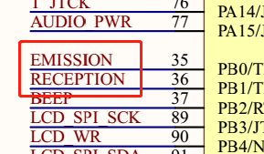
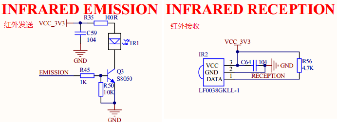
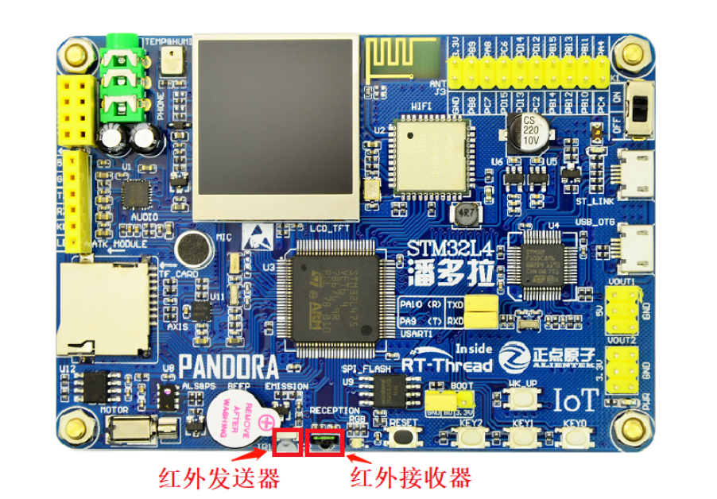

# 红外遥控例程

## 简介

本例程主要功能是通过板载的红外接收头学习红外遥控器信号以及通过板载的红外发射头发送学习到的红外信号。

## 硬件说明





如上图所示，红外发射脚 EMISSION 接单片机引脚 PB0（35号） ，红外接收头引脚 RECEPTION 接单片机引脚 PB1（36号，TIM3_CH4 通道）。

红外传感器在开发板中的位置如下图所示：



## 软件说明

红外驱动层的源代码位于 `/RT-Thread_IoT_SDK/drivers/drv_infrared.c` 中。

红外应用层的源代码位于 `/examples/05_basic_ir/applications/app_infrared.c` 中。

首先在 main 函数中，只是简单的调用红外应用层的应用函数。
```c
int main(void)
{
    unsigned int count = 1;
    app_infrared_init();
    while (count > 0)
    {
        app_ir_learn_and_send();
        count++;
    }
    return 0;
}
```
 drv_infrared.h 向应用层提供这样几个函数接口：
```c
/* 初始化红外。 */
int infrared_init(void);
/* 获取红外数据。data 的低 16 位是从红外信号开始的计数值，计数值单位为 us 。 */
rt_err_t infrared_raw_receive(rt_uint32_t *data);
/* 持续发送红外信号。 */
void infrared_continue_send(rt_uint8_t sign, rt_uint16_t us);
/* 开启学习模式，并指定学习的超时时间与红外信号接收触发之后的超时时间。 */
rt_err_t start_ir_learning(rt_int32_t start_timeout_ms, rt_int32_t recv_timeout_ms);
/* 关闭学习功能。 */
void stop_ir_learning(void);
/* 接收数据，并指定学习的超时时间与红外信号接收触发之后的超时时间。 */
rt_size_t infrared_receive(rt_uint32_t *data, rt_size_t max_size, rt_int32_t start_timeout_ms, rt_int32_t recv_timeout_ms);
/* 发送红外数据。 */
rt_size_t infrared_send(const rt_uint32_t *data, rt_size_t size);
```

在 app_infrared.c 中除了调用红外驱动层的接口函数外，还初始化了板载蜂鸣器，RGB 灯，用于辅助提示当前的状态,下面着重讲解红外驱动层函数的调用。

```c
void app_ir_learn_and_send(void)
{
    volatile rt_size_t size;
    rt_int16_t key;
    rt_kprintf("\n");
    LOG_I("learning mode START.");
    rgb_ctrl(LED_RED);

    /* 调用 infrared_receive 将接收到红外数据存放到 buf 中，并返回接收到的数据长度。 */
    size = infrared_receive(buf, 1000, RT_WAITING_FOREVER, 750);
    if (size == 0)
    {
        LOG_W("nothing receive.");
    }

    LOG_I("learning mode STOP.");
    rgb_ctrl(LED_ALL_OFF);

    LOG_I("sending  mode .       | Press KEY2 exit send mode or Press KEY0 send infrared sign.");
    rgb_ctrl(LED_GREEN);
    while (1)
    {
        key = key_scan();
        /* 如果按键 KEY0 按下，将发送一次红外信号。 */
        if (key == PIN_KEY0)
        {
            rgb_ctrl(LED_BLUE);

            /* 调用 infrared_send 发送学习到的红外信号。 */
            if (infrared_send(buf, size) == size)
            {
                LOG_I("send ok.");
            }
            else
            {
                LOG_I("send fail.");
            }
            rgb_ctrl(LED_GREEN);
        }
        /* 如果按键 KEY2 按下则退出发送模式。 */
        else if (key == PIN_KEY2)
        {
            LOG_I("sending  mode EXIT.");
            break;
        }
        rt_thread_mdelay(10);
    }
}
```

## 运行

### 编译&下载

- **MDK**：双击 `project.uvprojx` 打开 MDK5 工程，执行编译。
- **IAR**：双击 `project.eww` 打开 IAR 工程，执行编译。

编译完成后，将开发板的 ST-Link USB 口与 PC 机连接，然后将固件下载至开发板。

### 运行效果

按下复位按键重启开发板，观察板载 RGB 灯，当红灯时长亮时表示可以学习红外信号，用户可以使用红外遥控器对准板载红外接收头发送红外信号。接收到红外信号后， RGB 灯自动变绿，绿色表示 IoT Board 已经学习完成，用户可以将 IoT Board 的板载红外发射头对准相应的设备，并按下 KEY0 按键发送学习到的信号。

| 按键 | 功能 | 备注 |
|---|---|---|
| KEY0 | IoT board 发送学习到的红外信号 | 只有在发送模式，即绿灯长亮的时候，才能使用。按下后蓝灯亮表示正在发送 |
| KEY2 | 退出发送模式 | 红灯表示学习模式，绿灯表示发送模式 |

另外在发送模式中，按下 KEY0 键可以听到蜂鸣器的叫声。

此时也可以在 PC 端使用终端工具打开开发板的 ST-Link 提供的虚拟串口，设置波特率： 115200 ，数据位： 8 ，停止位： 1 N 。开发板的运行日志信息即可实时输出来。

```shell
 \ | /
- RT -     Thread Operating System
 / | \     3.1.1 build Oct 10 2018
 2006 - 2018 Copyright by rt-thread team
 msh >
[I/app.infrared] learning mode START.
[I/app.infrared] learning mode STOP.
[I/app.infrared] sending  mode .       | Press KEY2 exit send mode or Press KEY0 send infrared sign.
[I/app.infrared] send ok.
[I/app.infrared] send ok.
[I/app.infrared] sending  mode EXIT.

[I/app.infrared] learning mode START.
```

## 注意事项

请使用 38KHZ 载波的红外遥控器实验。

## 引用参考

- 《通用GPIO设备应用笔记》: docs/an0002-rtthread-driver-gpio.pdf
- 《RT-Thread 编程指南》: docs/rtthread_manual.zh-2018-09-30.pdf