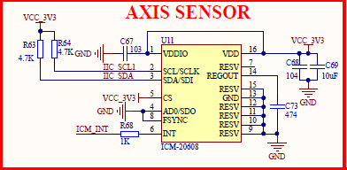
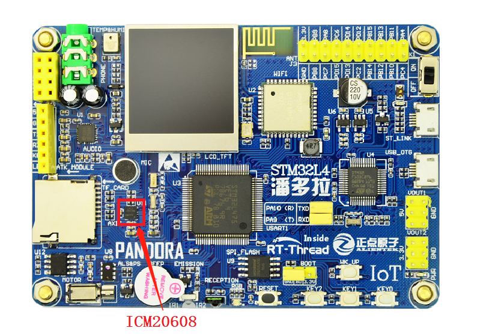
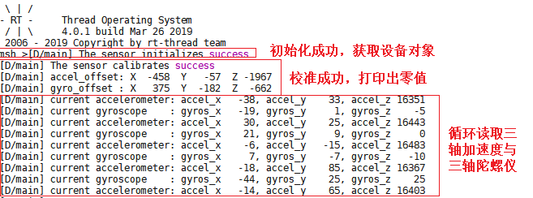

# ICM20608 六轴传感器例程

## 简介

本例程主要功能是利用 RT-Thread 的 ICM20608 软件包读取传感器 icm20608 所测量的三轴加速度（three accelerate）、三轴陀螺仪（three gyroscope）。

## ICM20608 软件包简介

ICM20608 软件包是 RT-Thread 针对六轴传感器 icm20608 功能使用的实现，使用这个软件包，可以让该传感器在 RT-Thread 上非常方便使用 icm20608 的基本功能，包括读取三轴加速度（3-axis accelerometer）、三轴陀螺仪（3-axis gyroscope）、零值校准等功能，如需详细了解该软件包，请参考 ICM20608 软件包中的 [README](https://github.com/RT-Thread-packages/icm20608/blob/master/README.md)。

## 硬件说明

`icm20608` 硬件原理图如下所示：



如上图所示，单片机通过 IIC_SDA(PC1)、IIC_SCL(PC0) 对传感器 `icm20608` 发送命令、读取数据等，ICM_INT(PC2) 为硬件中断引脚。

接近感应与光照强度传感器在开发板中的位置如下图所示：



该传感器能够实现如下功能：

- 支持4种三轴加速度量程
- 支持4种三轴陀螺仪量程
- 支持零值校准

## 软件说明

六轴传感器 `icm20608`的示例代码位于 `/examples/09_driver_axis/applications/main.c` 中，主要流程：初始化传感器 -> 零值校准 -> 读取三轴加速度与三轴陀螺仪，分别展开如下所述：

1. 初始化传感器

初始化函数 `icm20608_init` 传入的参数 `i2c_bus_name` 为该传感器挂载的 `i2c` 总线名称，进行初始化；初始化若失败，则返回空，若成功，则返回六轴传感器的设备对象 `dev`。

2. 零值校准

首先在进行零值校准时，`x` 轴、`y` 轴应处于**水平状态**，且传感器处于**静态**；其次使用零值校准函数 `icm20608_calib_level` 进行零值校准时，传入设备对象 `dev` 与 读取零值次数（此处为 10 次，可以改动），若失败，释放资源，提示失败，释放资源，若成功，返回 `RT_EOK`，零值数据存放在设备对象 `dev` 中，详细零值存放参考 [`icm20608 `软件包](https://github.com/RT-Thread-packages/icm20608) 中零值校准章节。

3. 读取三轴加速度与三轴陀螺仪

成功校准后，进行数据读取。如果失败，提示传感器不正常工作；如果成功，打印读取的三轴加速度与三轴陀螺仪的测量值（详细的 API 介绍参考 [`icm20608 `软件包](https://github.com/RT-Thread-packages/icm20608)读取三轴加速度与三轴陀螺仪章节，源码参考 [icm20608.c](https://github.com/RT-Thread-packages/icm20608/blob/master/icm20608.c)）。示例代码如下：

```c
int main(void)
{
    icm20608_device_t dev = RT_NULL;   /* device object */
    const char *i2c_bus_name = "i2c1"; /* i2c bus */
    int count = 0;                     /* read count */
    rt_err_t result;

    /* waiting for sensor going into calibration mode */
    rt_thread_mdelay(1000);

    /* initialize icm20608, registered device driver */
    dev = icm20608_init(i2c_bus_name);
    if (dev == RT_NULL)
    {
        rt_kprintf("The sensor initializes failure\n");

        return 0;
    }
    else
    {
        rt_kprintf("The sensor initializes success\n");
    }

    /* calibrate icm20608 zero level and average 10 times with sampling data */
    result = icm20608_calib_level(dev, 10);
    if (result == RT_EOK)
    {
        rt_kprintf("The sensor calibrates success\n");
        rt_kprintf("accel_offset: X%6d  Y%6d  Z%6d\n", dev->accel_offset.x, dev->accel_offset.y, dev->accel_offset.z);
        rt_kprintf("gyro_offset : X%6d  Y%6d  Z%6d\n", dev->gyro_offset.x, dev->gyro_offset.y, dev->gyro_offset.z);
    }
    else
    {
        rt_kprintf("The sensor calibrates failure\n");
        icm20608_deinit(dev);

        return 0;
    }
   /* continous reading 100 times */
    while (count++ < 100)
    {
        rt_int16_t accel_x, accel_y, accel_z;
        rt_int16_t gyros_x, gyros_y, gyros_z;

        /* get 3 accelerometer data */
        result = icm20608_get_accel(dev, &accel_x, &accel_y, &accel_z);
        if (result == RT_EOK)
        {
            rt_kprintf("current accelerometer: accel_x%6d, accel_y%6d, accel_z%6d\n", accel_x, accel_y, accel_z);
        }
        else
        {
            rt_kprintf("The sensor does not work\n");
            break;
        }

        /* get 3 gyroscope data */
        result = icm20608_get_gyro(dev, &gyros_x, &gyros_y, &gyros_z);
        if (result == RT_EOK)
        {
            rt_kprintf("current gyroscope    : gyros_x%6d, gyros_y%6d, gyros_z%6d\n\n", gyros_x, gyros_y, gyros_z);
        }
        else
        {
            rt_kprintf("The sensor does not work\n");
            break;
        }
        rt_thread_mdelay(1000);
    }

    return 0;
}
```

### 编译&下载

- **MDK**：双击 `project.uvprojx` 打开 MDK5 工程，执行编译。
- **IAR**：双击 `project.eww` 打开 IAR 工程，执行编译。

编译完成后，将开发板的 ST-Link USB 口与 PC 机连接，然后将固件下载至开发板。

### 运行效果

烧录完成后，此时可以在 PC 端使用终端工具打开开发板的 ST-Link 提供的虚拟串口，设置串口波特率为 115200，数据位 8 位，停止位 1 位，无流控，开发板的运行日志信息即可实时输出出来，显示如下图所示：



## 注意事项

暂无。

## 引用参考

- 《RT-Thread 编程指南》: docs/rtthread_manual.zh-2018-09-30.pdf
- 《I2C 设备应用笔记》: docs/an0003-rtthread-driver-i2c.pdf
- 《icm20608 软件包介绍》：[https://github.com/RT-Thread-packages/icm20608](https://github.com/RT-Thread-packages/icm20608)


